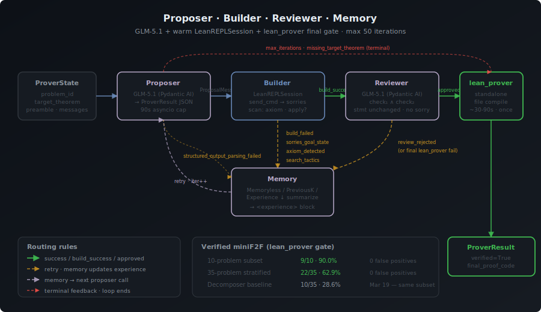
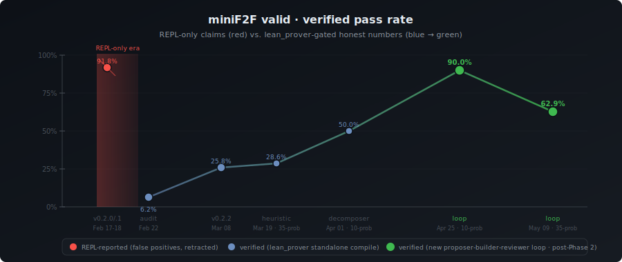

# Bourbaki Architecture

An AI agent for mathematical reasoning and theorem proving. Named after Nicolas Bourbaki, the collective pseudonym of mathematicians who wrote foundational treatises.

---

## System Overview

```
┌──────────────────────────────────────────────────────────────────────┐
│                         TUI (Bun + React + Ink)                      │
│                                                                      │
│  Input ──→ CLI ──→ useAgentRunner ──→ fetch POST /query              │
│                         │                    │                       │
│                   useModelSelection     SSE stream                   │
│                   useInputHistory       ← AgentEvents                │
│                         │                    │                       │
│            ProviderSelector            HistoryItemView               │
│            ModelSelector               ProofDisplay                  │
│            ApiKeyPrompt                EventListView                 │
│                                        ReasoningIndicator            │
└──────────────────────────────┬───────────────────────────────────────┘
                               │ HTTP + SSE
                               ▼
┌──────────────────────────────────────────────────────────────────────┐
│                    Python Backend (FastAPI + Pydantic AI)             │
│                                                                      │
│  Routes ──→ Agent Core ──→ Pydantic AI agent.iter()                  │
│                │                                                     │
│           Scratchpad (dedup + limits)                                 │
│                │                                                     │
│  ┌─────────┬──┴────┬──────────┬──────────┬──────────┬──────────┐    │
│  │SymPy    │Lean 4 │OEIS      │arXiv     │Exa       │Skills    │    │
│  │native   │subproc│httpx     │httpx     │httpx     │SKILL.md  │    │
│  └─────────┴───────┴──────────┴──────────┴──────────┴──────────┘    │
│                                                                      │
│  Sessions ──→ .bourbaki/sessions/                                    │
│  Prover loop ──→ proposer / builder / reviewer / memory              │
│  Problems ──→ 13 classic theorems                                    │
└──────────────────────────────────────────────────────────────────────┘
```

---

## Backend (Python)

### Tech Stack

- **Runtime:** Python 3.11+
- **Framework:** FastAPI with uvicorn
- **Agent:** Pydantic AI (`agent.iter()` for node-by-node control)
- **Streaming:** SSE via `sse-starlette`
- **Settings:** Pydantic Settings (loads from `.env`)
- **HTTP Client:** httpx (async, for external APIs)
- **Math:** SymPy (native symbolic computation)
- **Verification:** Lean 4 + Mathlib (async subprocess)

### Directory Layout

```
backend/bourbaki/
├── main.py                    # FastAPI app factory, CORS, router registration
├── config.py                  # Pydantic Settings, API key export
├── events.py                  # AgentEvent models (SSE wire format)
├── agent/
│   ├── core.py                # run_agent() — Pydantic AI agent loop
│   ├── context.py             # AgentDependencies (injected into tools)
│   ├── scratchpad.py          # Tool call tracking, limits, dedup
│   ├── prompts.py             # System prompt + iteration prompt builders
│   └── event_mapper.py        # Helper factories for AgentEvent creation
├── tools/
│   ├── symbolic_compute.py    # 30+ SymPy operations
│   ├── lean_prover.py         # Lean 4 subprocess (whole-file compile)
│   ├── lean_repl.py           # LeanREPLSession (warm Mathlib REPL)
│   ├── proof_code_builder.py  # assemble_standalone_proof(preamble, code)
│   ├── mathlib_search.py      # Loogle + LeanSearch + LeanExplore
│   ├── sequence_lookup.py     # OEIS API + 15 builtin sequences
│   ├── paper_search.py        # arXiv API
│   ├── web_search.py          # Exa API
│   └── skill_tool.py          # Loads SKILL.md instructions
├── skills/
│   ├── loader.py              # YAML frontmatter parser
│   └── registry.py            # Multi-source discovery + cache
├── sessions/
│   ├── manager.py             # CRUD, persistence, token tracking
│   └── context_compactor.py   # LLM-based conversation summarization
├── prover/                    # Proposer-builder-reviewer-memory loop
│   ├── prover.py              # ProverLoop + ProverConfig + routing
│   ├── proposer.py            # GLM-5.1 proposer node + mathlib_search wiring
│   ├── builder.py             # REPL-backed builder + typed feedback
│   ├── reviewer.py            # Reviewer node + lean_prover final gate
│   ├── memory.py              # Memoryless / PreviousK / Experience strategies
│   ├── feedback.py            # 10 typed feedback factories
│   ├── prompts.py             # PROPOSER / REVIEWER / EXPERIENCE prompts
│   └── state.py               # ProverState + Pydantic message models
├── autonomous/
│   └── tactics.py             # Tactic blocklist (kept; rest deleted in commit 2113629)
├── benchmarks/
│   ├── loader.py              # miniF2F problem loader
│   ├── minif2f.py             # attempt_proof_loop + attempt_proof_pass_at_n
│   └── putnam.py              # PutnamBench runner (ProverLoop-wired)
├── problems/
│   └── database.py            # 13 classic theorems with metadata
└── server/routes/
    ├── health.py              # GET /health
    ├── query.py               # POST /query (SSE)
    ├── compute.py             # POST /compute
    ├── prove.py               # POST /prove
    ├── search.py              # POST /search/sequence, /search/paper
    ├── export.py              # POST /export
    ├── sessions.py            # CRUD /sessions
    ├── problems.py            # GET /problems
    ├── autonomous.py          # /autonomous/* — all handlers return HTTP 410 Gone (deprecated; legacy pipeline removed in commit 2113629)
    └── skills.py              # GET /skills
```

---

## API Endpoints

### Health

| Method | Path | Description |
|--------|------|-------------|
| GET | `/health` | Returns `{"status": "ok", "python": true, "lean": bool}` |

### Agent Query

| Method | Path | Description |
|--------|------|-------------|
| POST | `/query` | Main agent endpoint. Returns SSE stream of `AgentEvent` objects |

**Request:**
```json
{
  "query": "Prove that sqrt(2) is irrational",
  "model": "openrouter:deepseek/deepseek-r1-0528:free",
  "model_provider": null,
  "session_id": "abc-123",
  "chat_history": [{"role": "user", "content": "..."}]
}
```

**Response:** Server-Sent Events stream. Each event is one of the types defined in [SSE Event Types](#sse-event-types).

### Symbolic Computation

| Method | Path | Description |
|--------|------|-------------|
| POST | `/compute` | Direct SymPy computation (bypasses agent) |

**Request:**
```json
{
  "operation": "factor_polynomial",
  "expression": "x^4 - 1",
  "variable": "x",
  "from_val": null,
  "to_val": null,
  "point": null,
  "matrix": null,
  "matrix2": null,
  "order": 6
}
```

**Response:**
```json
{
  "success": true,
  "result": "(x - 1)*(x + 1)*(x**2 + 1)",
  "latex": "(x - 1)(x + 1)(x^{2} + 1)",
  "numeric": null,
  "duration": 12
}
```

### Lean Verification

| Method | Path | Description |
|--------|------|-------------|
| POST | `/prove` | Run Lean 4 code for verification |

**Request:**
```json
{
  "code": "theorem foo : 1 + 1 = 2 := by norm_num",
  "mode": "check",
  "timeout": 30
}
```

**Response:**
```json
{
  "success": true,
  "goals": [],
  "proofComplete": true,
  "errors": null,
  "rawOutput": "...",
  "codeUsed": "...",
  "duration": 1500
}
```

### Search

| Method | Path | Description |
|--------|------|-------------|
| POST | `/search/sequence` | OEIS sequence lookup |
| POST | `/search/paper` | arXiv paper search |

**Sequence request modes:** `"identify"` (match terms, requires 3+), `"search"` (text query), `"get"` (by ID like A000045)

**Paper request modes:** `"search"` (keyword search), `"get"` (by arXiv ID)

### Export

| Method | Path | Description |
|--------|------|-------------|
| POST | `/export` | Export proof as LaTeX, Lean, or Markdown |

**Request:**
```json
{
  "title": "Irrationality of sqrt(2)",
  "statement": "...",
  "proof": "...",
  "lean_code": "...",
  "sympy_computations": [],
  "format": "latex"
}
```

### Sessions

| Method | Path | Description |
|--------|------|-------------|
| GET | `/sessions` | List all sessions (most recent first) |
| POST | `/sessions` | Create new session (body: `{"model": "..."}`) |
| GET | `/sessions/{id}` | Load session by ID |
| DELETE | `/sessions/{id}` | Delete session |
| GET | `/sessions/{id}/messages` | Get messages for context restoration |

Sessions are stored as JSON files in `.bourbaki/sessions/{id}.json`. Token count is estimated (`len(text) // 4`) and auto-compaction triggers at 100k tokens, summarizing older messages while keeping the 6 most recent.

Max 50 sessions are retained (oldest auto-deleted).

### Problems

| Method | Path | Description |
|--------|------|-------------|
| GET | `/problems` | List problems. Query params: `domain`, `technique`, `min_difficulty`, `max_difficulty`, `famous` |
| GET | `/problems/random` | Random problem. Query params: `domain`, `difficulty`, `technique` |
| GET | `/problems/{id}` | Get specific problem by ID |

**13 built-in problems** across Number Theory (6) and Combinatorics (4+):

| ID | Title | Difficulty | Technique |
|----|-------|-----------|-----------|
| sum-of-integers | Sum of first n integers | 1 | induction |
| sum-of-squares | Sum of squares formula | 2 | induction |
| euclid-primes | Infinitely many primes | 2 | contradiction |
| sqrt2-irrational | Irrationality of sqrt(2) | 2 | contradiction |
| bezout-identity | Bezout's identity | 3 | strong-induction |
| fermat-little | Fermat's little theorem | 3 | induction |
| pigeonhole-basic | Basic pigeonhole | 1 | pigeonhole |
| handshaking-lemma | Handshaking lemma | 2 | counting |
| ramsey-r33 | R(3,3) = 6 | 3 | pigeonhole + cases |
| erdos-ko-rado | Erdos-Ko-Rado theorem | 4 | counting + contradiction |

### Autonomous Proof Search (deprecated)

| Method | Path | Description |
|--------|------|-------------|
| POST | `/autonomous/start` | **HTTP 410 Gone** — legacy strategy-queue pipeline removed in commit `2113629` |
| POST | `/autonomous/pause` | **HTTP 410 Gone** |
| POST | `/autonomous/resume` | **HTTP 410 Gone** |
| GET | `/autonomous/progress` | **HTTP 410 Gone** |
| GET | `/autonomous/insights` | **HTTP 410 Gone** |

The 18-strategy + checkpoint/resume engine that previously served these
routes (`autonomous/search.py`, `strategies.py`, `modal_runner.py`,
`progress.py`) was deleted in Phase 3 along with the HILBERT pipeline.
The proposer-builder-reviewer loop in `backend/bourbaki/prover/` is the
current proving engine; drive it via `attempt_proof_loop` in
`benchmarks/minif2f.py` or via `POST /query` with `use_loop=True`.

### Skills

| Method | Path | Description |
|--------|------|-------------|
| GET | `/skills` | List all available proof technique skills |

Returns: `[{"name": "proof-by-induction", "description": "...", "source": "builtin"}, ...]`

---

## SSE Event Types

Events are streamed from `POST /query` as Server-Sent Events. Each line is `data: <json>`.

| Type | Fields | Description |
|------|--------|-------------|
| `thinking` | `message` | Agent reasoning step |
| `tool_start` | `tool`, `args` | Tool execution beginning |
| `tool_end` | `tool`, `args`, `result`, `duration_ms` | Tool execution completed |
| `tool_error` | `tool`, `error` | Tool execution failed |
| `tool_limit` | `tool`, `warning`, `blockReason`, `blocked` | Tool rate limit hit |
| `answer_start` | — | Agent beginning final answer |
| `done` | `answer`, `toolCalls[]`, `iterations` | Query complete |
| `checkpoint` | `checkpointId`, `iteration`, `reason`, `filepath`, `message` | Autonomous search checkpoint |
| `resume` | `checkpointId`, `iteration` | Resumed from checkpoint |

---

## Tools

The agent has 6 tools available during query processing. Each tool is guarded by the scratchpad (default limit: 3 calls per tool per query, Jaccard similarity dedup at 0.7 threshold).

### symbolic_compute

Native SymPy computation with 30+ operations.

**Operations by category:**

| Category | Operations |
|----------|------------|
| Number Theory | `factor_integer`, `prime_factors`, `is_prime`, `divisors`, `euler_phi`, `gcd`, `lcm`, `mod`, `mod_inverse` |
| Algebra | `factor_polynomial`, `simplify`, `expand`, `solve`, `evaluate` |
| Series | `sum_series`, `product_series`, `limit` |
| Calculus | `derivative`, `integral`, `taylor_series` |
| Matrix | `matrix_mult`, `determinant`, `eigenvalues`, `matrix_inverse`, `row_reduce`, `characteristic_polynomial`, `minimal_polynomial` |
| Analysis | `fourier_series`, `laplace_transform` |

### lean_prover

Runs Lean 4 code via async subprocess. Writes temp files to `.bourbaki/lean-temp/`, runs `lean` (or `lake env lean` as fallback), parses errors and goals from output. Default timeout: 30 seconds.

### sequence_lookup

OEIS sequence identification and lookup. Has 15 built-in sequences (Fibonacci, primes, powers of 2, squares, triangular numbers, factorials, Catalan numbers, etc.) as fast fallback. Falls through to OEIS API at `https://oeis.org/search`.

### paper_search

arXiv paper search. Supports keyword search and fetch-by-ID. Covers 14 math categories (math.NT, math.CO, math.AG, math.CA, math.LO, math.PR, math.GR, math.AT, math.RT, math.FA, math.DG, math.AP, math.OA, math.QA). Truncates abstracts to 300 characters.

### web_search

Exa API for academic and general web search. Categories: `"research paper"`, `"tweet"`, `"company"`, `"news"`, `"github"`, `"pdf"`. Requires `EXASEARCH_API_KEY`.

### skill_invoke

Loads proof technique instructions from SKILL.md files. Returns the full instruction text for the agent to follow. Skills are discovered from three directories with increasing precedence: builtin (`src/skills/`) < user (`~/.bourbaki/skills/`) < project (`.bourbaki/skills/`).

---

## Scratchpad

The scratchpad tracks tool usage per query to prevent waste:

- **Call limits:** Each tool can be called at most `tool_call_limit` times per query (default: 3)
- **Deduplication:** Jaccard similarity > 0.7 between queries to the same tool triggers a warning or block
- **Last-call warning:** When a tool has 1 call remaining, the agent is warned
- **Skill tracking:** Records which skills have been invoked to prevent re-loading

---

## Skills (21 Proof Techniques)

SKILL.md files contain structured instructions for proof techniques. Each has YAML frontmatter (name, description) and markdown body with steps, tool usage guidance, output format, and common patterns.

| Category | Skills |
|----------|--------|
| Basic | proof-by-induction, strong-induction, direct-proof, proof-by-contradiction, pigeonhole-argument, counting-argument |
| Analysis | epsilon-delta-proof, convergence-test, sequence-limit, inequality-chain |
| Geometry | coordinate-proof, synthetic-construction, transformation-proof |
| Algebra | group-homomorphism, ring-ideal-proof, polynomial-proof |
| Advanced | extremal-argument, probabilistic-method, conjecture-exploration, formalize-informal-proof, explain-proof |

---

## Autonomous Proof Search (historical — deleted in Phase 3)

The 18-strategy priority-queue pipeline that previously sat behind
`/autonomous/*` was removed in commit `2113629` along with the rest of the
HILBERT-style decomposer. See "Solver Architecture" below for the
proposer-builder-reviewer loop that replaced it.

Historical table preserved for context only — none of these strategies
are reachable from current code:

| Strategy (deleted) | Priority | Type |
|---------------------|---------:|------|
| direct-computation | 100 | Compute |
| direct-proof | 90 | Logic |
| simple-induction | 85 | Induction |
| pigeonhole | 85 | Combinatorics |
| strong-induction | 80 | Induction |
| double-counting | 80 | Combinatorics |
| structural-induction | 75 | Induction |
| generalized-pigeonhole | 75 | Combinatorics |
| contradiction | 70 | Logic |
| infinite-descent | 65 | Number Theory |
| case-analysis | 60 | Logic |
| algebraic-manipulation | 55 | Algebra |
| extremal-principle | 50 | Optimization |
| similar-problems | 45 | Meta |
| probabilistic-method | 40 | Combinatorics |
| generalize | 35 | Meta |
| specialize | 30 | Meta |
| counterexample-search | 25 | Meta |

Replaced by: one proposer (GLM-5.1) that emits a complete proof per
iteration; routing is governed by typed builder/reviewer feedback rather
than a strategy queue.

---

## Frontend (TUI)

### Tech Stack

- **Runtime:** Bun
- **Framework:** React 19 + Ink 6 (terminal UI)
- **Language:** TypeScript
- **Deps:** dotenv, ink-spinner, ink-text-input

### Directory Layout

```
src/
├── index.tsx                  # Entry point: render(<CLI />)
├── cli.tsx                    # Main CLI component, command parser
├── constants.ts               # DEFAULT_PROVIDER, DEFAULT_MODEL
├── theme.ts                   # Color palette (purple/green/cyan)
├── components/
│   ├── index.ts               # Re-exports
│   ├── Intro.tsx              # Welcome banner with ASCII art
│   ├── Input.tsx              # Text input with cursor, slash commands, tab complete
│   ├── ModelSelector.tsx      # Provider + model selection UI, PROVIDERS registry
│   ├── ApiKeyPrompt.tsx       # API key confirmation + input
│   ├── ProofDisplay.tsx       # Markdown-rendered proof output
│   ├── AgentEventView.tsx     # Tool call / thinking event rendering
│   ├── HistoryItemView.tsx    # Single query-response turn
│   ├── ReasoningIndicator.tsx # Animated status indicator
│   ├── DebugPanel.tsx         # Debug log viewer
│   └── CursorText.tsx         # Text with block cursor
├── hooks/
│   ├── useAgentRunner.ts      # SSE connection to /query, history state
│   ├── useModelSelection.ts   # Provider → model → API key flow
│   ├── useInputHistory.ts     # Up/down arrow command history
│   ├── useTextBuffer.ts       # Low-level text editing + cursor
│   └── useDebugLogs.ts        # Debug log subscription
├── agent/
│   ├── types.ts               # AgentEvent union, AgentConfig, Message
│   └── sessionManager.ts      # TUI-side session tracking
├── utils/
│   ├── config.ts              # Read/write .bourbaki/settings.json
│   ├── env.ts                 # API key checking + saving to .env
│   ├── logger.ts              # Debug logger with subscription
│   ├── math-format.ts         # LaTeX → Unicode (170+ patterns)
│   ├── markdown-table.ts      # Markdown tables → box-drawing
│   ├── input-utils.ts         # Cursor navigation helpers
│   ├── thinking-verbs.ts      # 73 random verbs for status display
│   ├── ollama.ts              # Fetch local Ollama model list
│   └── long-term-chat-history.ts  # Persistent chat history stack
└── skills/                    # 21 SKILL.md files (proof techniques)
```

### Model Selection

Models are defined in `src/components/ModelSelector.tsx` in the `PROVIDERS` array. Each provider has a `providerId`, `displayName`, and list of `models`.

The `/model` TUI command triggers a multi-step flow:

```
idle → provider_select → model_select → [api_key_confirm → api_key_input] → idle
```

When a model is selected, it's stored as `provider:model` (e.g., `openrouter:deepseek/deepseek-r1-0528:free`) and persisted to `.bourbaki/settings.json`.

### Available Providers and Models

| Provider | Provider ID | Models | API Key Env Var |
|----------|------------|--------|-----------------|
| OpenRouter | `openrouter` | openrouter/pony-alpha, openrouter/aurora-alpha, arcee-ai/trinity-large-preview:free, stepfun/step-3.5-flash:free, qwen/qwen3-next-80b-a3b-instruct:free, z-ai/glm-4.5-air:free, qwen/qwen3-coder:free, deepseek/deepseek-r1-0528:free | `OPENROUTER_API_KEY` |
| Ollama Cloud | `ollama-cloud` | qwen3-coder:480b-cloud, kimi-k2-thinking:cloud, kimi-k2:1t-cloud, deepseek-v3.1:671b-cloud, minimax-m2:cloud, glm-4.6:cloud, qwen3-vl:235b-instruct-cloud, qwen3-vl:235b-cloud, gpt-oss:120b-cloud, gpt-oss:20b-cloud | `OLLAMA_CLOUD_API_KEY` |
| OpenAI | `openai` | gpt-5.2, gpt-4.1 | `OPENAI_API_KEY` |
| Anthropic | `anthropic` | claude-sonnet-4-5, claude-opus-4-5 | `ANTHROPIC_API_KEY` |
| Google | `google` | gemini-3-flash-preview, gemini-3-pro-preview | `GOOGLE_API_KEY` |
| xAI | `xai` | grok-4-0709, grok-4-1-fast-reasoning | `XAI_API_KEY` |
| Ollama (Local) | `ollama` | Dynamic (fetched from local Ollama API) | None |

### TUI Commands

| Command | Action |
|---------|--------|
| `/help` | Show all commands |
| `/model` | Change model/provider |
| `/sessions` | List saved sessions |
| `/sessions <id>` | Restore a session |
| `/restore <id>` | Restore a session |
| `/new` | Start fresh session |
| `/debug` | Toggle debug panel |
| `/problems` | List available problems |
| `/prove <id>` | Legacy handler — POSTs to `/autonomous/start` which now returns 410. Use `attempt_proof_loop` or `/query` with `use_loop=True` for the current loop. |
| `/pause` | Legacy handler (410 Gone) |
| `/progress` | Legacy handler (410 Gone) |
| `/skills` | List available proof techniques |
| `/export [format]` | Export last proof (latex/lean/markdown) |
| `exit` / `quit` | Exit CLI |

### Keyboard Shortcuts

| Key | Action |
|-----|--------|
| `Enter` | Submit query |
| `Shift+Enter` | Newline (multi-line input) |
| `Up/Down` | Navigate command history |
| `Ctrl+A` | Move to line start |
| `Ctrl+E` | Move to line end |
| `Option+Left/Right` | Move by word |
| `Option+Backspace` | Delete word backward |
| `Tab` | Autocomplete slash command |
| `Escape` | Cancel selection or running query |
| `Ctrl+C` | Cancel or exit |

### Data Flow

```
User types query
  ↓
handleSubmit() in cli.tsx
  ↓ (not a /command)
runQuery(text) via useAgentRunner
  ↓
buildModelStr() → "openrouter:openrouter/pony-alpha"
  ↓
ensureSession() → POST /sessions (if no session yet)
  ↓
fetch(POST /query, {query, model, session_id})
  ↓
SSE stream begins
  ↓
handleEvent() dispatches:
  thinking  → update ReasoningIndicator
  tool_start → add to EventListView
  tool_end   → complete tool event
  answer_start → transition to answering
  done       → render final ProofDisplay
```

---

## Configuration

### Environment Variables

Create a `.env` file in the project root (already gitignored):

| Variable | Required | Description |
|----------|----------|-------------|
| `OPENROUTER_API_KEY` | At least one LLM key | OpenRouter API key (access many models with one key) |
| `OPENAI_API_KEY` | At least one LLM key | OpenAI API key |
| `ANTHROPIC_API_KEY` | At least one LLM key | Anthropic API key |
| `GOOGLE_API_KEY` | At least one LLM key | Google AI API key |
| `XAI_API_KEY` | At least one LLM key | xAI API key |
| `OLLAMA_CLOUD_API_KEY` | Optional | Ollama Cloud API key |
| `EXASEARCH_API_KEY` | Optional | Exa search API key (for web/paper search) |
| `LEAN_PATH` | Optional | Path to Lean 4 project with Mathlib |
| `BOURBAKI_BACKEND_URL` | Optional | Backend URL for TUI (default: `http://localhost:8000`) |

The backend loads `.env` from both `backend/.env` and the project root `.env` (via Pydantic Settings `env_file` config). API keys are auto-exported to environment variables on startup so Pydantic AI SDKs can discover them.

### Runtime Data

All runtime data lives in `.bourbaki/` (gitignored):

```
.bourbaki/
├── settings.json              # TUI settings (provider, model)
├── sessions/                  # Session JSON files
├── progress/                  # Autonomous search checkpoints
├── lean-temp/                 # Temporary Lean files
└── messages/                  # Chat history for TUI
```

---

## Running

```bash
# Start the Python backend
cd backend && uvicorn bourbaki.main:app --reload --port 8000

# Start the TUI (in another terminal)
bun start

# Or point TUI at a different backend
BOURBAKI_BACKEND_URL=http://localhost:8000 bun start
```

---

## Integrations

| Integration | Protocol | Purpose | Auth |
|-------------|----------|---------|------|
| OpenRouter | HTTPS (via Pydantic AI) | LLM inference for multiple model providers | `OPENROUTER_API_KEY` |
| OpenAI | HTTPS (via Pydantic AI) | GPT models | `OPENAI_API_KEY` |
| Anthropic | HTTPS (via Pydantic AI) | Claude models | `ANTHROPIC_API_KEY` |
| Google AI | HTTPS (via Pydantic AI) | Gemini models | `GOOGLE_API_KEY` |
| xAI | HTTPS (via Pydantic AI) | Grok models | `XAI_API_KEY` |
| Ollama | HTTP (localhost:11434) | Local model inference | None |
| OEIS | HTTPS (`oeis.org/search`) | Integer sequence lookup | None |
| arXiv | HTTPS (`export.arxiv.org/api`) | Paper search | None |
| Exa | HTTPS (`api.exa.ai/search`) | Academic/general web search | `EXASEARCH_API_KEY` |
| Lean 4 | Local subprocess | Formal theorem verification | Lean 4 + Mathlib installed |
| SymPy | Python native | Symbolic computation | None (bundled) |

---

## Solver Architecture

The solver is the proving engine that takes a Lean 4 theorem statement and produces a verified proof. As of Phase 3 (commit `2113629`, May 2026), it runs a single proposer-builder-reviewer-memory loop in the style of ax-prover — no recursive decomposition, no best-first tactic search, no multi-agent coordinator. The whole pipeline is one bounded async `while` loop driven by GLM-5.1 and a warm `LeanREPLSession`.

<p align="center">
  
</p>

### The loop

One iteration per proposal. Hard cap at 50 iterations (8 in interactive / CI) — the loop owns its own attempts counter so a streak of parse failures can't run forever.

1. **Proposer** (`backend/bourbaki/prover/proposer.py`) — Pydantic AI agent with `output_type=ProverResult` (4 fields: `reasoning`, `imports`, `opens`, `updated_theorem`). System prompt at `prompts.PROPOSER_SYSTEM_PROMPT`. User message bundles the target theorem, the complete file, the last attempt (proposal + feedback) if any, and the current `<experience>` block. Per-LLM-call timeout: 90s (`asyncio.wait_for`).

2. **Builder** (`backend/bourbaki/prover/builder.py`) — sends `state.preamble + proposal.code` (with `import` lines stripped, since the REPL already has Mathlib) to `session.send_cmd(...)`. Inspects the result and emits typed feedback:

   - any compiler message with `severity == "error"` → `build_failed`
   - `sorries` non-empty → `sorries_goal_state` carrying the inline `goal` per sorry
   - scan for `\baxiom\b` → `axiom_detected`
   - scan for `\b(apply|exact)\?` → `search_tactics_detected`
   - `contains_blocklisted_tactic` from `autonomous/tactics.py` matches → `search_tactics_detected`
   - target theorem not declared in the proposal → `missing_target_theorem` (non-terminal — the proposer retries with the correct name)
   - else → `build_success`

3. **Reviewer** (`backend/bourbaki/prover/reviewer.py`) — second Pydantic AI agent with `output_type=ReviewDecision`. Two real checks (`check_1`: statement signature unchanged · `check_2`: no `sorry`/`admit` in the proposed body) plus two honeypots ignored by the caller. On approval, runs `lean_prover` **once** on the assembled standalone source (`assemble_standalone_proof(preamble, proposal.code)`) — this is the ground-truth gate that catches REPL false positives.

4. **Memory** (`backend/bourbaki/prover/memory.py`) — three strategies, swappable via `ProverConfig.memory_cls`:

   - `MemorylessMemory` — returns `""` (default).
   - `PreviousKMemory(k)` — renders the last K (proposal, feedback) pairs verbatim, wrapped in `<previous-attempts>`.
   - `ExperienceMemory(model)` — calls GLM-5.1 once per retry to compress prior lessons into a fresh `<experience>` block. Falls back to the prior experience on LLM error so a transient API hiccup doesn't wipe context.

### Routing (mirrors ax-prover)

Three `_route_*` methods, each returns `"continue" | "retry" | "end"`:

- **proposer:** terminal feedback (`max_iterations`) → end · non-proposal (parsing failure) → retry · otherwise → continue
- **builder:** `is_terminal` → end · `is_success` → continue · otherwise → retry
- **reviewer:** `is_terminal` → end · `kind == "review_approved"` → continue · otherwise → retry

A `retry` edge always goes through `Memory.process(state)` before the next proposer call.

### Files

```
backend/bourbaki/prover/
├── state.py         # ProverState, ProposalMessage, FeedbackMessage,
│                    # ProverResult, ReviewDecision (all Pydantic)
├── feedback.py      # 10 typed feedback factories (build_success,
│                    # build_failed, sorries_goal_state, axiom_detected,
│                    # search_tactics_detected, missing_target_theorem,
│                    # review_approved, review_rejected, max_iterations,
│                    # structured_output_parsing_failed)
├── prompts.py       # PROPOSER / REVIEWER / EXPERIENCE prompts (GLM-5.1 targeted)
├── proposer.py      # run_proposer + mathlib_search tool wiring
├── builder.py       # run_builder + REPL response parsing
├── reviewer.py      # run_reviewer + final lean_prover gate
├── memory.py        # BaseMemory + 3 strategy implementations
└── prover.py        # ProverConfig + ProverLoop (driver + routing)
```

```
backend/bourbaki/tools/
├── lean_prover.py        # whole-file Lean compile (reviewer's final gate)
├── lean_repl.py          # warm LeanREPLSession (builder backend)
├── proof_code_builder.py # assemble_standalone_proof(preamble, code)
└── mathlib_search.py     # Loogle + LeanSearch + LeanExplore (proposer tool)
```

The only legacy file that survived Phase 3 is `autonomous/tactics.py` — its blocklist (`_BLOCKED_TACTICS`, `_BLOCKED_PATTERNS`, `contains_blocklisted_tactic`) is still load-bearing for catching REPL false positives in the builder.

### Pass@N sampling

`attempt_proof_pass_at_n` runs the loop up to N times per problem, returning the first verified result. Plumbed via `run_minif2f(pass_n=N)`. Default `pass_n=1` is a no-op so existing benchmark runs are unaffected. Shared REPL session across attempts — known leakage caveat documented in the function docstring (lean4-repl has no clean `:reset` primitive).

### Why this replaced the HILBERT pipeline

The previous pipeline (sketch → formalize → decompose → search-tree → stitch) sat at 5/10 (50%) on the same 10-problem subset where the loop now hits 9/10 (90%), and on a 35-problem stratified sample it scored 10/35 (28.6%) where the loop now hits 22/35 (62.9%) — both with zero false positives.

Most of the win came from removing brittle stitching: the decomposer solved subgoals individually but the regex-replacement in `formalizer.stitch_proofs()` produced malformed Lean code in many cases. The loop's proposer generates a complete proof in one shot, so the stitching failure mode is gone by construction.

The full delta in code: **+118 / -6,576 lines** in commit `2113629`. See `.bourbaki/plans/refactor-audit.md` for the keep/reuse/drop classification.

### Lean Interaction

Two complementary tools for Lean 4 interaction:

| Tool | Speed | Use Case |
|------|-------|----------|
| `lean_tactic` (REPL) | ~30ms/tactic | Interactive proof construction, search tree expansion |
| `lean_prover` (subprocess) | ~90s/call | Final whole-file verification |

The REPL maintains a persistent subprocess (`lake env lean-repl`) with Mathlib loaded. Commands are JSON over stdin/stdout with environment chaining (`env` IDs). A `REPLSessionPool` supports up to N parallel sessions.

### Mathlib Search

Three complementary APIs for finding relevant lemmas:

| Mode | API | Strength |
|------|-----|----------|
| `type` / `name` | Loogle (`loogle.lean-lang.org`) | Exact type signature matching |
| `natural` | LeanSearch (`leansearch.net`) | Natural language queries |
| `semantic` | LeanExplore (`leanexplore.com/api/v2`) | Hybrid semantic + BM25 + PageRank |

The search tree queries all three modes with deduplication by lemma name. Semantic mode tries LeanExplore first (requires API key) and falls back to LeanSearch.

### Autoformalize

Converts natural language to Lean 4 code in two modes:

| Mode | Process |
|------|---------|
| `statement` | LLM generates Lean code → verify with `lean_prover` → retry once on failure |
| `proof_step` | LLM generates a single tactic for the current proof state |

```
backend/bourbaki/tools/autoformalize.py
```

---

## Benchmark

### miniF2F

The standard benchmark for automated theorem proving. 488 problems (244 validation, 244 test) from AMC, AIME, IMO, and textbooks, formalized in Lean 4.

```
backend/bourbaki/benchmarks/
├── loader.py            # Parse Lean 4 files, extract theorem statements
└── minif2f.py           # Runner: attempt_proof, attempt_proof_repl,
                         #         attempt_proof_loop, attempt_proof_pass_at_n
```

**Benchmark runner flow (`use_loop=True` path, the new default):**

1. Load problems from `.bourbaki/miniF2F-lean4/` Lean files
2. Initialize REPL with full Mathlib import (~80s one-time)
3. For each problem: `attempt_proof_loop(problem, session, config, timeout)` — runs `ProverLoop.run` until `state.verified`, terminal feedback, or timeout
4. Mandatory `_verify_with_lean_prover` post-hook on every reported solve — false-positive catcher independent of the reviewer's own `lean_prover` call

**Current results (miniF2F valid split, 244 problems):**

<p align="center">
  
</p>

**Honest verified-pass-rate history (miniF2F valid split):**

| Date | Approach | Verified | Rate | Sample |
|------|----------|----------|------|--------|
| 2026-02-17 (v0.2.0) | Best-first search, **REPL-only** ⚠ — RETRACTED | claimed 224/244 | claimed 91.8% | full 244 |
| 2026-02-18 (v0.2.1) | + multi-agent coordinator, **REPL-only** ⚠ — RETRACTED | claimed 230/244 (test) | claimed 94.3% (test) | full 244 |
| 2026-02-22 (audit) | Same code, `lean_prover` standalone verify | 15/244 | **6.2%** | full 244 |
| 2026-03-08 (v0.2.2) | + REPL pipe-recovery + tactic blocklist | 63/244 | 25.8% | full 244 |
| 2026-03-19 | + heuristic search | 10/35 | 28.6% | 35-problem stratified |
| 2026-04-01 | + HILBERT decomposer + in-context solving | 5/10 | 50.0% | 10-problem subset |
| 2026-04-25 | **Proposer-builder-reviewer loop (GLM-5.1)** | **9/10** | **90.0%** | 10-problem subset · 0 false positives |
| 2026-05-09 | Same loop, post-fix suite | **22/35** | **62.9%** | 35-problem stratified · 0 false positives |

The Feb 17 / Feb 18 numbers (91.8% / 94.3%) were inflated ~15× by REPL
false positives — the REPL reported `goals=[]` for tactics whose
standalone Lean compile would have failed. Both v0.2.0 and v0.2.1
releases on GitHub have been retracted (their titles now read
"RETRACTED (inflated numbers)"). Every solve since v0.2.2 is gated by
`lean_prover`'s whole-file compile. See
[`docs/REALITY_CHECK.md`](docs/REALITY_CHECK.md) for the full audit.

The 90% on the 10-problem subset and 62.9% on the 35-problem stratified
sample are both gated by `lean_prover` with 0 false positives reported.
A full 244-problem re-run with the new loop is the v0.3.0 release
blocker, tracked in [issue #14](https://github.com/0bserver07/bourbaki/issues/14).

### Comparison with Reference Systems

⚠ Reference systems are on the *full* 244-problem split. Bourbaki's
last honest full-split number (25.8% from v0.2.2) trails the field;
the loop's 90% / 62.9% are on a 10-problem subset and a 35-problem
stratified sample respectively. Full 244 run with the new loop is
tracked in [#14](https://github.com/0bserver07/bourbaki/issues/14).

| System | Organization | miniF2F Valid (full 244) | Key Technique |
|--------|-------------|---------------|---------------|
| HILBERT | Apple | 99.2% | Recursive decomposition + Goedel-V2-32B + MPNet retrieval |
| Goedel-Prover V2 | — | 90.4% | 2-round self-correction (8B matches 671B) |
| Aristotle | Harmonic | 90% | MCGS + 200B transformer + test-time training |
| DeepSeek-Prover V2 | DeepSeek | 88.9% | Recursive decomposition + GRPO RL |
| **Bourbaki (v0.2.2)** | — | **25.8%** verified | Best-first search + lean_prover gate |
| **Bourbaki (loop, 35-problem)** | — | 22/35 (62.9%) on stratified sample | Proposer-builder-reviewer + GLM-5.1 |
| **Bourbaki (loop, 10-problem)** | — | 9/10 on subset | Proposer-builder-reviewer + GLM-5.1 |

### Capability Matrix

| Capability | HILBERT | Aristotle | DeepSeek-V2 | Numina | Bourbaki (current) |
|------------|---------|-----------|-------------|--------|--------------------|
| Best-first search | Yes | MCGS | Sampling | Yes | Deleted in Phase 3 |
| Recursive decomposition | Core | No | Core | Blueprint | Deleted in Phase 3 (proposer can still emit `have/sorry` blocks) |
| Semantic retrieval | MPNet+FAISS | — | — | LeanDex | LeanExplore API (mathlib_search tool) |
| Self-correction | — | — | — | — | Yes — proposer iterates on typed feedback |
| Multi-agent | — | — | — | Claude+MCP | No (single GLM-5.1 proposer + single reviewer) |
| Lean LSP | — | — | — | 17 tools | No (REPL + whole-file lean_prover) |
| Trained value model | Goedel-V2-32B | 200B | GRPO RL | — | None — typed feedback only |
| Pass@N sampling | — | — | — | — | Yes (`attempt_proof_pass_at_n`, default N=1) |

---

## Adding Models

To add new models to a provider, edit the `PROVIDERS` array in `src/components/ModelSelector.tsx`. Models are strings matching the format expected by the provider's API (e.g., OpenRouter uses `org/model-name` format).

To change the default model, edit `src/constants.ts`:

```typescript
export const DEFAULT_PROVIDER = 'openrouter';
export const DEFAULT_MODEL = 'openrouter:openrouter/pony-alpha';
```

The backend's default model (used when no model is specified) is set in `backend/bourbaki/config.py`:

```python
default_model: str = "openai:gpt-4o"
```

The TUI default takes precedence since it always sends a model with each request.
