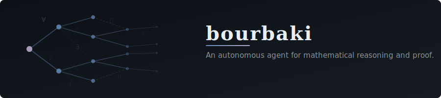
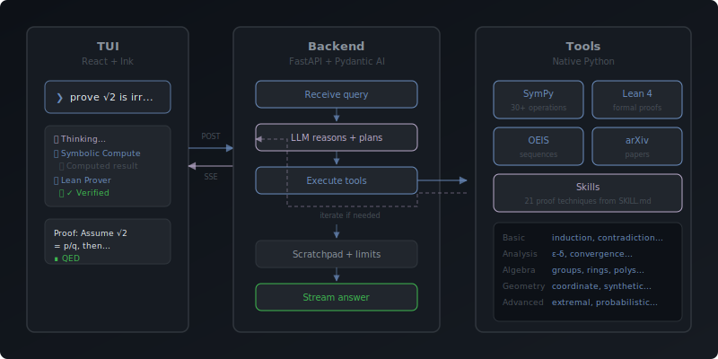

<p align="center">
  
</p>

<p align="center">
  <strong>An autonomous agent for mathematical reasoning and proof.</strong>
</p>

<p align="center">
  <a href="#how-it-works">How It Works</a> &middot;
  <a href="#quick-start">Quick Start</a> &middot;
  <a href="#tools">Tools</a> &middot;
  <a href="#skills">Skills</a> &middot;
  <a href="#autonomous-mode">Autonomous Mode</a> &middot;
  <a href="#commands">Commands</a>
</p>

<p align="center">
  
  
  
  
  
</p>

---

[Claude Code](https://docs.anthropic.com/en/docs/claude-code/overview) gives an LLM a shell and dev tools so it can write and run code. Bourbaki does the same thing for math: it gives an LLM a computer algebra system (SymPy), a proof assistant (Lean 4), and research APIs (OEIS, arXiv).

You ask a question in the TUI, the agent computes, verifies, looks things up, and streams the answer back. If it writes a proof, it can formalize it. If it makes a claim, it can check it.

## How It Works

<p align="center">
  
</p>

1. You ask a question in the TUI
2. The backend agent reasons about the approach
3. It calls tools: SymPy for computation, Lean for verification, OEIS/arXiv for lookup
4. Results feed back into the agent, which iterates if needed
5. A scratchpad enforces limits and deduplicates repeated calls
6. The final answer streams back to the TUI as it's generated

The TUI is a pure display client. All reasoning, tool calls, and state live in the Python backend.

## Quick Start

```bash
# Clone the repo
git clone https://github.com/0bserver07/bourbaki.git
cd bourbaki

# Start the backend
cd backend
pip install -e .
uvicorn bourbaki.main:app --reload --port 8000

# In another terminal — start the TUI
bun install
bun start
```

The TUI connects to `localhost:8000` by default. Override with `BOURBAKI_BACKEND_URL`.

### Prerequisites

- [Python 3.11+](https://python.org)
- [Bun](https://bun.sh) v1.0+
- An LLM API key (set `ANTHROPIC_API_KEY`, `OPENAI_API_KEY`, or `GOOGLE_API_KEY`)
- [Lean 4](https://lean-lang.org/) with Mathlib (optional, for formal verification)

## Tools

| Tool | What it does |
|------|-------------|
| **Symbolic Compute** | Native SymPy: simplification, integration, solving, 30+ operations |
| **Lean Prover** | Lean 4 + Mathlib, machine-checked formal proofs |
| **Sequence Lookup** | OEIS: identify and explore integer sequences |
| **Paper Search** | arXiv: find relevant papers and results |
| **Web Search** | Exa: search the web for mathematical references |

## Skills

Skills are proof techniques loaded from `SKILL.md` files. They tell the agent how to approach a specific type of proof step by step, instead of letting it improvise.

21 built-in skills across five categories:

- **Basic:** induction, strong induction, direct proof, contradiction, pigeonhole, counting
- **Analysis:** epsilon-delta, convergence tests, sequence limits, inequality chains
- **Geometry:** coordinate proof, synthetic construction, transformations
- **Algebra:** group homomorphisms, ring ideals, polynomials
- **Advanced:** extremal arguments, probabilistic method, conjecture exploration, formalization, proof explanation

Skills can be added at three levels: built-in (`src/skills/`), user (`~/.bourbaki/skills/`), or project (`.bourbaki/skills/`).

## Autonomous Mode

Long-running proof search. The agent tries different strategies, backtracks when stuck, and remembers what worked and what didn't across iterations. Start from the TUI with `/prove <problem_id>` or via the API.

## Example Usage

**Prove a theorem:**
```
❯ Prove that the sum of the first n integers equals n(n+1)/2

⏺ Thinking...
⏺ Symbolic Compute (expression=Sum(k, (k, 1, n)))
  ⎿ Computed result
⏺ Lean Prover
  ⎿ ✓ Verified in 2.3s

Proof by induction. Base case: n = 1, sum = 1 = 1·2/2. ✓
Inductive step: assume ∑_{k=1}^{n} k = n(n+1)/2.
Then ∑_{k=1}^{n+1} k = n(n+1)/2 + (n+1) = (n+1)(n+2)/2. ∎
```

**Compute symbolically:**
```
❯ Factor 84 and find its divisors

⏺ Symbolic Compute (operation=factor, expression=84)
  ⎿ Computed result

84 = 2² × 3 × 7
Divisors: {1, 2, 3, 4, 6, 7, 12, 14, 21, 28, 42, 84}
```

**Identify a sequence:**
```
❯ What sequence is 1, 1, 2, 3, 5, 8, 13?

⏺ Sequence Lookup (query="1,1,2,3,5,8,13")
  ⎿ Found 1 results

A000045 — Fibonacci numbers: F(n) = F(n-1) + F(n-2) with F(0) = 0 and F(1) = 1.
```

## Commands

| Command | What it does |
|---------|-------------|
| `/help` | Show all commands |
| `/model <name>` | Switch LLM model |
| `/skills` | List available proof technique skills |
| `/problems` | Browse the problem database |
| `/prove <id>` | Start autonomous proof search on a problem |
| `/pause` | Pause autonomous search |
| `/progress` | Show autonomous search progress |
| `/sessions` | List saved sessions |
| `/new` | Start a new session |
| `/export [format]` | Export last answer (latex, lean, markdown) |
| `/debug` | Toggle debug mode |
| `/clear` | Clear the screen |

## Architecture

```
src/                          React + Ink TUI (display client)
├── components/               UI components (Input, AgentEventView, AnswerView)
├── hooks/                    useAgentRunner (SSE bridge), useModelSelection
└── skills/                   21 SKILL.md proof technique files

backend/bourbaki/             Python backend (owns all state)
├── agent/                    Pydantic AI agent, prompts, scratchpad, event mapper
├── tools/                    SymPy, Lean 4, OEIS, arXiv, Web Search, Skills
├── sessions/                 Persistence + context compaction
├── autonomous/               Long-running proof search with strategies
├── problems/                 13 classic problems database
└── server/routes/            FastAPI endpoints (query, sessions, skills, ...)
```

## Tech Stack

- **Backend:** Python, FastAPI, Pydantic AI, SymPy, httpx
- **TUI:** Bun, React + Ink, TypeScript
- **Verification:** Lean 4 + Mathlib
- **Sequences:** OEIS API
- **Papers:** arXiv API

## Credits

Named after [Nicolas Bourbaki](https://en.wikipedia.org/wiki/Nicolas_Bourbaki), the collective pseudonym of a group of mathematicians who tried to rewrite all of mathematics from scratch using set theory.

## License

[MIT License](LICENSE)
